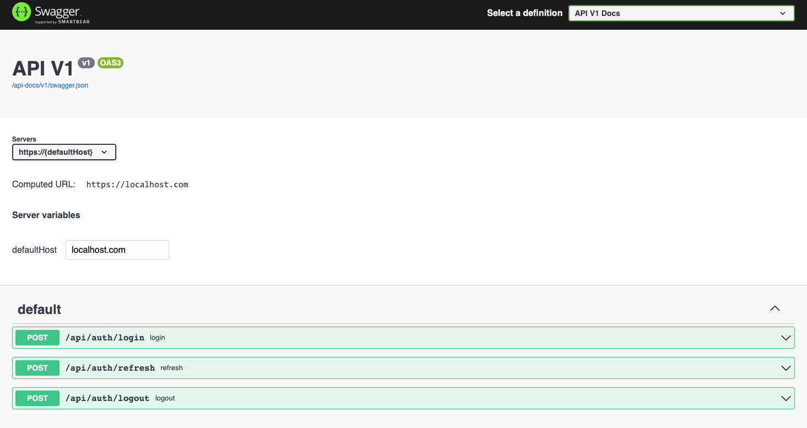

# README

[](https://github.com/rubocop/rubocop)


Ruby On Rails Forum API Project.

## Stacks

[Ruby On Rails](https://rubyonrails.org/)

[PostgreSQL](https://www.postgresql.org/)

[ElasticSeach](https://www.elastic.co/)

## Getting Started

This project is warped up with docker-compose.

### Build and setup project

```bash
make init
```

Seed data:

```bash
make db-seed
```

Import elasticsearch post index:

```bash
make es-import
```

### Start project

```bash
docker-compose up
```

## Tests

[Rspec](https://github.com/rspec/rspec-rails) is setup to run the tests automatically.
Spec files are in [specs](./spec/)

Please run the tests with

```bash
make rspec
```

## Github Actions

[Github Action](https://github.com/UoooBarry/rails-forum/actions) is setup to run the rspec and rubocop automatically. Failures will be marked in the pipelines.

## API

### Response Format

Each response will contains a `meta` object,
You can get the status code and message from the `meta` object.

```json
"meta": {
  "status": 200,
  "message": "success"
}
```

When errors occur, the status and message fields in `meta` will be filled with the error message.

```json
"meta": {
  "status": 401,
  "message": "Information provided is not correct"
}
```

### Documentation



A swagger [JSON file](swagger/v1/swagger.json) is provided to describe the API.

You can access api-doc via [/api-docs](http://localhost:3000/api-docs)

### Summary

```text
POST /api/users 注册
POST /api/auth/login 登陆
POST /api/auth/refresh 刷新令牌
POST /api/auth/logout 登出
GET /api/communities 社区列表
POST /api/communities 创建新社区, 创建者会被设置成管理员
GET /api/communities/:id 社区详情
POST /api/communities/:id/set_admin 增加社区管理员, 验证社区管理员权限
POST /api/communities/:id/subscribe 订阅社区
POST /api/communities/:id/unsubscribe 取消订阅社区
GET /api/posts 帖子列表, 可以指定社区id, 用户id或全文搜索
POST /api/posts 发布帖子
POST /api/posts/:id 帖子详情
PATCH /api/posts/:id 更新帖子
DELETE /api/posts/:id 删除帖子/回复
POST /api/posts/:id/like 点赞帖子
POST /api/posts/:id/reply 回复帖子
POST /api/posts/:id/pin 置顶帖子, 验证社区管理员权限
```

### Update api doc

[Rswag](https://github.com/rswag/rswag) is used to write endpoint tests and auto generate descriptions.

```bash
make swaggerize
```
